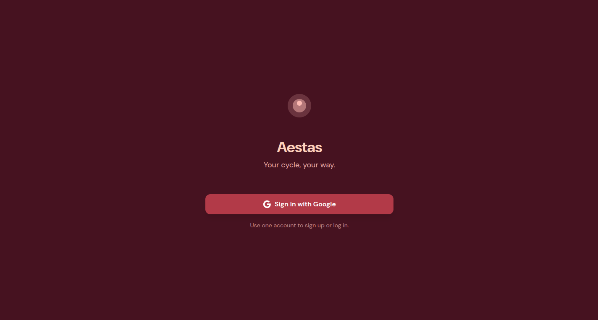

# Aestas

A modern cycle-tracking app: sign in with Google, set your cycle length, log period days, and see phase-based suggestions on the main calendar. Built with React/Vite/Tailwind (frontend), FastAPI (backend), PostgreSQL, and Redis, orchestrated with Docker Compose.




## Quick start

1. **Google OAuth**
   Create an OAuth 2.0 Client in [Google Cloud Console](https://console.cloud.google.com/) and set **Authorized redirect URI** to `http://localhost:8000/auth/callback`. See [docs/02-google-oauth-setup.md](docs/02-google-oauth-setup.md).

2. **Environment**
   Copy `.env.example` to `.env` in the project root and set `GOOGLE_CLIENT_ID` and `GOOGLE_CLIENT_SECRET`.

3. **Run**
   ```bash
   docker compose up --build
   ```
   Frontend: **http://localhost:5173** · Backend: **http://localhost:8000** (Postgres + Redis start with them).
   Open the frontend URL, sign in with Google → Onboarding (cycle length + last cycle) → Track / Insights / Friends tabs.

## Project structure

- **frontend/** — React + Vite + Tailwind (Welcome, Onboarding, LastCycle, AppShell tabs: Track / Insights / Friends; API client; `useAuth` hook).
- **backend/** — FastAPI (OAuth, Redis sessions, PostgreSQL users, POST `/users/onboarding`).
- **docs/** — Educational docs (overview, Google OAuth, OAuth/sessions, database/onboarding, Docker/CI, pre-commit).
- **docker-compose.yml** — frontend (Vite dev server), backend, postgres, redis.

## Development

- **Full stack in Docker**: `docker compose up --build` — frontend on 5173, backend on 8000. Frontend source is mounted so edits trigger Vite HMR.
- **Frontend only locally**: `cd frontend && npm install && npm run dev` (talks to backend at `http://localhost:8000`).
- **Backend only locally**: `cd backend && pip install -r requirements.txt && uvicorn main:app --reload` (set `DATABASE_URL`, `REDIS_URL`, `GOOGLE_*`).
- **Pre-commit**: `pip install pre-commit && pre-commit install`.
- **CI**: GitHub Actions on push/PR to `main` (frontend lint/build, backend lint + smoke test).

## Docs (educational)

All in **docs/**:

1. [01-overview-and-setup.md](docs/01-overview-and-setup.md) — What the app does, stack, layout, how to run.
2. [02-google-oauth-setup.md](docs/02-google-oauth-setup.md) — Create Google OAuth client and redirect URI.
3. [03-oauth-and-sessions.md](docs/03-oauth-and-sessions.md) — OAuth flow and Redis sessions.
4. [04-database-and-onboarding.md](docs/04-database-and-onboarding.md) — PostgreSQL schema and onboarding API.
5. [05-docker-and-ci.md](docs/05-docker-and-ci.md) — Docker Compose and GitHub Actions CI.
6. [06-pre-commit.md](docs/06-pre-commit.md) — Pre-commit hooks and usage.
7. [07-cycle-phases.md](docs/07-cycle-phases.md) — Four cycle phases and the dashboard under the calendar.
8. [08-circle-follows.md](docs/08-circle-follows.md) — Nickname search, friend vs partner follows, privacy.

## Palette

- **Night Bordeaux** `#461220`
- **Burnt Rose** `#8c2f39`
- **Dusty Mauve** `#b23a48`
- **Powder Blush** `#fcb9b2`
- **Peach Fuzz** `#fed0bb`

## License

Private / unlicensed unless you add one.
